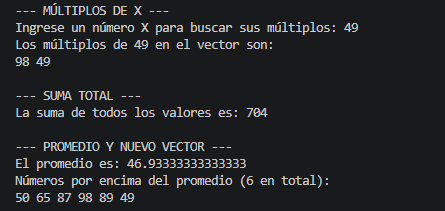

# EA1 - Manipulación de Vectores en Java

## 🎯 Objetivo
Practicar operaciones con vectores en Java: búsqueda, máximos, mínimos, múltiplos, suma y creación de nuevos vectores basados en el promedio.

## 📸 Capturas de pantalla

### 1. Llenado del vector

### 2. Busqueda, Máximos, Mínimos

### 3. Multiplos, Suma Total y Promedio (Nuevo Vector)

## 🎥 Video de sustentación
[Ver video](https://drive.google.com/drive/u/1/folders/1fFu__w0C0K_j4N02cyQCD7xkI5ObHpMa)

## 🛠️ Tecnologías
- Java (Eclipse Temurin)
- Visual Studio Code
- Git y GitHub